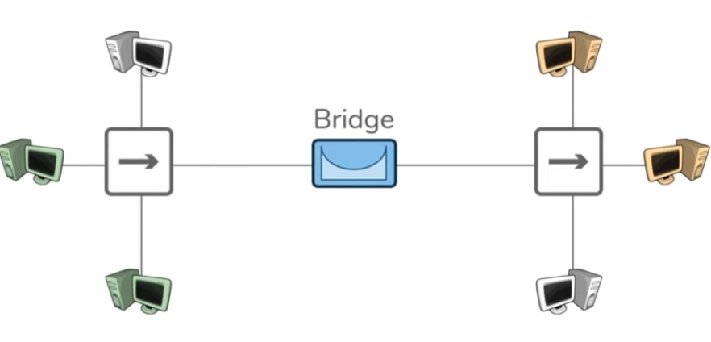
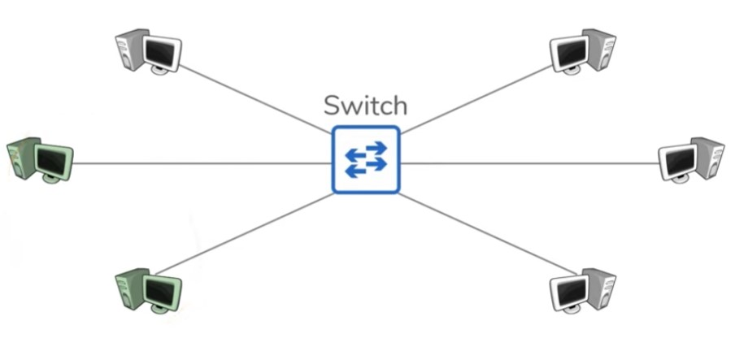

# Networking Fundamentals – Lesson 2: Network Devices 

 **network devices**. This lesson is part of the first module of the **Networking Fundamentals** course.

## 🧠 Lesson Objective

To understand how **data flows through the internet**, building from previous concepts (host, IP address, network) and focusing on the roles of **network devices**, especially **switches** and **routers**.

## 📡 Signal Decay and the Need for Repeaters

- A **network** is created when two computers are connected using a wire.
- **Signal decay** occurs when data travels longer distances.
  - For short distances (e.g. same room), this isn't a problem.
  - Over longer distances (e.g. across buildings), data may fail to reach the destination.

### 🔁 Repeater

- A **repeater** is a device that **regenerates signals**.
- Used to span greater distances by boosting decaying signals.

---

## 🔌 Why We Need More Than Direct Connections

- If we add more hosts to a network, direct connections become **unscalable**:
  - Every new host must connect to **every existing host**.
- Solution: Use a **central device** that all hosts connect to.

---

## 📍 Hub

- A **hub** is a **multi-port repeater**.
- It **duplicates incoming packets** to **all other ports**.
- Solves the scalability issue.
- **Downside**: All hosts receive **every packet**, even if not intended for them.

---

## 🧱 Bridge

- A **bridge** connects two sets of hub-connected devices.
- Has **two ports**, one for each side.
- Learns **which hosts are on each side**.
- **Filters traffic** so that only necessary packets cross the bridge.

### Example:
- If a green host sends a packet to another green host, the bridge keeps it on that side.
- Only forwards packets to the other side **when needed**.

---

## 🔀 Switch

- A **switch** is like a combination of a **hub** and a **bridge**.
  - Like a hub: multiple devices can connect to it.
  - Like a bridge: it **learns which host is on which port**.

### Behavior:
- Sends packets only to the port of the **intended recipient**.
- Keeps unrelated traffic from reaching other hosts.

---

## 📖 Formal Definition

> A **switch** is a device that facilitates communication **within** a network.

- A **network** is a group of hosts that require **similar connectivity**.
- All hosts in the same network **share the same IP address space**:
  - Example: `192.168.1.X`

---

## 🏠 Home and School Examples

- In a **home network**:
  - Host A (printer): `192.168.1.10`
  - Host B (laptop): `192.168.1.50`
  - Host C (phone): `192.168.1.66`

- In a **school**:
  - Classroom 1 (Biology): uses basic internet.
  - Classroom 2 (Computer Science): needs cloud access.

These different needs are why networks are **logically separated**.

---

## 🧷 Recap So Far

| Device   | Function                                                                 |
|----------|--------------------------------------------------------------------------|
| Repeater | Boosts weak signals over long distances                                  |
| Hub      | Multi-port repeater that duplicates data to all ports                    |
| Bridge   | Learns and filters traffic between two network segments                  |
| Switch   | Combines hub and bridge functionality; keeps traffic only where needed   |

---

## 🌐 Router – The Network Boundary Device

### 🌟 Primary Role

- Routers **connect different networks**.
- They act as **gateways** between those networks, including the **internet** (the "network of networks").

---

## 🚦 Routers Provide Traffic Control

- Routers can **filter or redirect traffic** between networks.
- This makes them great places to implement:
  - Security policies
  - Traffic filters
  - Routing decisions

> 🔐 Switches typically do not apply security filtering within a network, although modern "layer 3" switches can.

---

## 🌍 Logical Separation via Routers

- Devices with different connectivity needs should be placed in **separate networks**.
- Routers define the **boundary between networks**, enabling isolation and control.

---

## 🧭 How Routers Work

1. Routers **learn** what networks they are connected to.
   - Example:
     - Interface A → `172.16.20.0/24`
     - Interface B → `172.16.30.0/24`
     - Interface C → Internet

2. This knowledge is stored in a **routing table**, which lists:
   - All known networks
   - The path (interface) to each

3. Each interface of a router has an **IP address** in that network:
   - Example:
     - `172.16.20.1` (gateway for one network)
     - `172.16.30.254` (gateway for another)

4. Hosts in each network configure their **default gateway** to the router's IP on that network.

---

## 📤 Example: Default Gateway

- Host: `172.16.20.33`
- Default Gateway: `172.16.20.1`
  - This is the IP of the router interface in the same network.
  - When the host wants to contact an external network, it sends the traffic to the gateway.

---

## 🏢 Organization Network Example

- In a company like **Acme Corp**:
  - Each department (e.g., Sales, Marketing, Engineering) may be on a **different subnet**.
  - Each subnet connects to a **local router**.
  - Those routers may connect to a **core router** or to the **internet**.

> 📦 Data between departments goes through **multiple routers**, each using its **routing table** to forward the packet to the next hop.

---

## 🧳 Routers Enable Global Internet Traffic

- Example:
  - A **host in New York** wants to contact a **host in Tokyo**.
  - The data is routed through:
    - Local router → core routers → internet backbone → remote routers → destination host.

> 🌐 The **internet itself** is just a massive **collection of interconnected routers**.

---

## 🧠 Final Concepts

### 📌 Routing vs. Switching

- **Routing** = Moving data **between networks**
  - Device: **Router**
- **Switching** = Moving data **within a network**
  - Device: **Switch**

> Many devices (e.g. firewalls, load balancers, access points) perform routing/switching even if not named as such.

---

## ☁️ Cloud Devices

- **Virtual Routers**, **Virtual Switches**, etc., also exist in the cloud.
- The **function** is more important than the **form** (physical vs virtual).

---

## 📚 Recap of Device Roles

| Device Type | Purpose                          |
|-------------|----------------------------------|
| Repeater    | Regenerates weak signals         |
| Hub         | Broadcasts packets to all ports  |
| Bridge      | Connects & filters two networks  |
| Switch      | Directs packets within a network |
| Router      | Routes packets between networks  |

